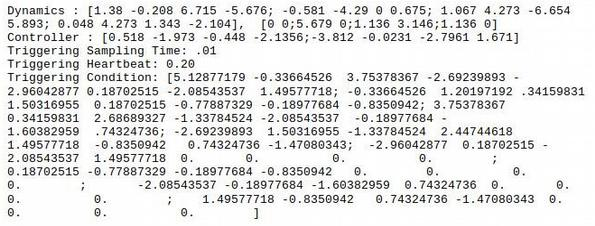

# SENTIENT
Toolchain for abstraction and scheduling of event-triggered controllers.
The project consists of two main parts:
- Creating abstraction/traffic models of Event-Triggered Controllers (ETC):
  - For linear PETC system (cite...)
  - For nonlinear ETC systems, with or without disturbances (cite ...)
- Generating schedulers for a collection of ETC systems:
  - Using timed game automata and UPPAAL Stratego (cite ...)
  - Using transitions systems and fixed point iterations (cite ...)

## Table of contents

--------------------------------------
- [Installation](#installation)
  - [Prerequisites](#prerequisites)
  - [Conda](#conda)
  - [Pip](#pip)
- [Quickstart](#quickstart)
- [Command Line Interface](#command-line-interface)
  - [Linear PETC](#linear-petc-input-fields)
  - [Nonlinear ETC](#nonlinear-etc-input-fields)
- [Examples](#examples)
  - [Traffic Model Examples](#traffic-model-examples)
    - [Linear PETC](#linear-petc)
    - [Nonlinear ETC](#nonlinear-etc)
  - [Scheduling Examples](#scheduling-examples)
    - [NTGAs and UPPAAL Stratego](#scheduling-using-ntgas-and-uppaal-stratego)
    - [Safety Games](#scheduling-by-solving-safety-games)


## Installation

---------------------------------------

### Prerequisites
This tool requires Python 3.8 to function correctly, so make sure it is installed beforehand, by running:
```bash
   $ add-apt-repository ppa:deadsnakes/ppa 
   $ apt update
   $ apt install python3.8
```

First, download or clone the project to a local directory. Secondly, run one of the scripts in ``scripts/``, corresponding to your OS to install the dependencies (it might be necessary to make it executable by using `chmod +x`).
Thirdly, download and copy the third-party tools, dReal, dReach, and Flow* in the 'third-party' folder in the root project
directory if you want to install them. You can download them from below location:

    dReal - https://github.com/dreal/dreal4
    dReach - https://github.com/dreal/dreal3/releases/tag/v3.16.06.02
    Flow* - https://flowstar.org/dowloads/

 - Make sure to get Flow* version v2.0.0, and run ``make`` in its directory. 
 - Build dReal4 by following the instructions provided in its ``README.md``
 - In the file ``/dreal-3.16.06.02-*/bin/dReach``, replace the following line
    ``` bash
   SCRIPT_PATHNAME=`python -c "import os,sys; print os.path.realpath(\"$0\")"`
    ```
   By:
   ``` bash
   SCRIPT_PATHNAME=`python2 -c "import os,sys; print(os.path.realpath(\"$0\"))"`
    ```
   To make sure Python 2 is used here.
   
 Finally, add the paths to ``config.py``, e.g.
   ```python
   dreal_path = '<path>/sentient/third-party/dreal4/bazel-bin/dreal/dreal'
   dreach_path = '<path>/sentient/third-party/dReal-3.16.06.02-*/bin/dReach'
   flowstar_path = '<path>/sentient/third-party/flowstar-2.0.0/flowstar-2.0.0/flowstar'
   ```

   To be able to create schedulers with timed automata, [UPPAAL Stratego](https://people.cs.aau.dk/~marius/stratego/) also needs to be installed. Then the path to ``verifyta`` has to be set in ``config.py`` as well:
   ```python
   VERIFYTA = '<path>/uppaal64-4.1.20-stratego-7/bin-Linux/verifyta'
   ```
### Conda

To install with conda, make sure a C/C++ compiler (e.g. ``gcc``/``g++``) and GMP is installed. Then simply run
``` shell
   $ conda env create --file environment.yml
   $ conda activate sentient
   $ conda install conda-build
   $ conda develop .
```
where the last two lines are necessary (temporarily, until a proper conda package has been built) to import ``SENTIENT`` in a script.

### Pip

Installation with pip is a bit more involved, as more packages will have to be build from source (depending on your OS). First create a virtual environment:
```shell
$ python3.8 -m venv <path-to-venv>
```

Activate the environment and install:
``` shell
   $ source <path-to-venv>/bin/activate
   $ pip install wheel
   $ pip install .
```

To use `graph-tool`, we have to link to `dist-packages` (in the default python installation):

```shell
$ cd <path-to-venv>/lib/python3.8/site-packages/
$ touch dist-packages.pth
$ echo "/usr/lib/python3/dist-packages/" >> dist-packages.pth
```

If you want to use the CUDD bindings for [dd](https://github.com/tulip-control/dd), then also run:
``` shell
   $ pip install --force-reinstall -r \
         <(echo "dd --install-option='--fetch' --install-option='--cudd'")
```

# Quickstart

***
For a quickstart, the command line tool `etc2pta.py` can be used. 
It can generate traffic models for linear PETC systems, and for nonlinear 
ETC systems. The command line interface is used as follows:

```shell
$ python etc2traffic.py <systemtype> <inputfile> [options]
```

Systemtype is either `linear' or 'nonlinear', from which the corresponding abstraction 
algorithm is chosen. Input file is a file containing the details for the ETC system. 
The contents of this file depend on the abstraction algorithm. 
The following shows an example input file for linear PETC systems:

 


For example, running the example `linear_ifac2020.txt` and outputting is done as:
```shell
$ python etc2traffic.py linear examples/linear_ifac2020.txt --output_file=ex.json
```
Or, for nonlinear ETC system, you can run one of the following examples:
```shell
$ python etc2traffic.py nonlinear examples/nl_homogeneous.txt --output_file=hom.json
$ python etc2traffic.py nonlinear examples/nl_nonhomogeneous.txt --output_file=nonhom.json
$ python etc2traffic.py nonlinear examples/nl_perturbed.txt --output_file=dist.json
```


-------------------------
The following shortly discusses some usage and examples.
For a more in depth documentation, see ``docs/``

# Command Line Interface

-----------------------------

The command line interface `etc2pta.py` can be used for generating traffic models for 
both linear PETC and nonlinear ETC systems. The command line interface usage is as follows:
```shell
$ python etc2traffic.py <systemtype> <inputfile> [options]
```

The argument `systemtype` is either `linear` or `nonlinear` and `inputfile` is the 
path to the input file. If `linear` is specified it will generate a linear PETC traffic model ([], [], []). 
See [Linear PETC Traffic Models](#linear-petc-traffic-models) for the details.  
If `nonlinear` is specified, it will generate a nonlinear ETC traffic model ([], []).
Depending on the systemtype, the contents of the inputfile should be different. 
See [Nonlinear ETC Traffic Models](#nonlinear-etc-traffic-models) for the details.  

### Linear PETC Input Fields
The required input fields are: 
- Dynamics: `Dynamics: A, B` which are the matrices describing the LTI 
  system `dx/dt = Ax + Bu`.
  
- Controller: `Controller: K`, which is the control matrix rendering the LTI system stable(!).
- Triggering Sampling Time: `Triggering Sampling Time: h`, which is the PETC sampling time in seconds.
- Triggering Heartbeat: `Triggering Heartbeat: hmax`, which is the maximum time until the PETC triggers in seconds.
- Triggering Condition: `Triggering Condition: Q`, which is the matrix in the quadratic triggering condition `x^TQx > 0`.

Elements in matrices are seperated with a `,`, rows are seperated with a `;`. E.g.: `[0 1;-2 3]` 

Optional arguments are:
- Lyapunov function: `Lyapunov Function: P`, the positive definite matrix P in the 
  Lyapunov function `V(x) = x^T Px`, which shows that the LTI system is stable. If this is not given,
  it will be generated automatically based on the provided LTI system and controller.
  
- Solver Options: `Solver Options: `
  - `kmaxextra: n`. Compute the transitions for inter-event times larger than `kmax`. Default: `None` 
    (this sets the value to `kmax + max_delay_steps`)
    
  - `cost_computation=b`. Set to `True` if transition costs should be computed. Default: `False`
  - `mu_threshold=f`. If `f >= 0`, tries to remove regions that are geometrically similar. The bigger the number the more regions that are likely removed. Default: `0.0`
  - `min_eig_threshold=f`. The minimum value the smallest eigenvalue of the matrix describing
        a state-space region must have for this region to be considered.
        If bigger than 0.0, it typically results in a maximum uniform
        inter-event time smaller than what would naturally occur, but for a
        very small subset of the state-space. Default: `0.0`
  
  - `reduced_actions=b`. If True, action set is equal to the set of possible inter-event
        times. Default: `False`
  - `early_trigger_only=b`. If True, transitions from a region (i, ...) are computed for inter-
        event times up to i + max_delay_steps. Default: `False`
  - `max_delay_steps=f`. The maximum extra discrete time for which transitions are computed.
        That is, for a region (i, ...), transitions are computed from kmin
        until min(kmaxetra, i + max_delay_steps). Default: `0`
  - `depth=n`. Maximum depth of the bisimulation algorithm. Default: `1`. For `n > 1`, it is recommended to set `solver=z3`.
  - `etc_only=f`. Set to True if early trigger transitions should not be computed.
        This is useful for verification, but not for scheduling, since the
        resulting abstraction becomes autonomous. Default: `False`
  - `end_level=f`: If stop_around_origin is true, specifies the sublevel set
        {x: x'Px <= end_level} from which the bisimulation algorithm stops.
        This assumes that the initial states are normalized to satisfy
        x(0)'Px(0) = 1. Default: `0.01`
  - `solver=sdr|z3`. The solver to be used to compute the transition relations. Default: `sdr`
  - `stop_around_origin=b`. Set to True if the bisimulation algorithm should stop one all states
        are guaranteed to have entered a ball around the origin. Default: `False`
  - `stop_if_omega_bisimilar=b`. Set to True if the bisimulation algorithm should stop if an omega-
        bisimulation is found. Default:`False`
    
  - `symbolic=b`. (Current not yet working). Whether to perform the calculations symbolically. Default: `False`
  - `consider_noise=b`. Not yet Implemented! Whether pure measurement noise is to be considered. Default: `False`

### Nonlinear ETC Input Fields
The dynamics, controller, etc. are expressed and inputted using `sympy` expressions. To make sure no errors occur,
some conventions have been defined. There are a few sets of possible variables:
- State variables: Starting with an `x`.
- Input variables: Starting with an `u`.
- Error variables: Starting with an `e`.
- Homogeneous variable: A single variable `w1`, used for making dynamics homogeneous.
- Disturbance variables: Starting with a `d`. 

By convention, every variables should be numbered sequentially starting from 1: `x1, x2, ...`, `u1, u2, ...`, etc.
The input fields are:
- Dynamics: `Dynamics: x_1dot, x_2dot, ...`, describing the dynamics of the nonlinear system. 
  - The number of used state variables should match the number of given expressions.
  - If one or more input variables are present, the field `Controller` should be filled in as well.
  - If variables `e1, ...` are present in the dynamics, it is assumed that the system is in ETC form,
    and the number of them should equal the number of state variables. If they are not specified,
    the dynamics will automatically be converted into ETC form, but only if controller expression are specified.
    If both error and input variables are present in the dynamics, an error is thrown.
  - If variables `w1, ...` are present in the dynamics, it is assumed that the system is homogenized,
    and the correctness is checked first.
  - If variables `d1, ...` are present in the dynamics, `Hyperbox Disturbances` should be specified as well.
    This will also automatically overwrite the partitioning method to `grid`.
- Controller: `Controller: u1expr, u2expr`, describing the controller. The number of given expression should match
  the number of input variables in the dynamics.    
- Triggering Condition: `Triggering Condition: expr`. The triggering condition. Should contain both `x` and `e` variables.
  
- Homogeneity degree: `Deg. of Homogeneity: n`. The degree of homogeneity of the dynamics. If not specified, will 
  automatically be calculated.

- State space limits: `Hyperbox States: [a1 b1], [a2 b2], ...`. The state space region that is considered during 
  generation of the traffic model, represented by an interval. The number of given intervals should match the number of 
  state variables.    

- Disturbance limits: `Hyperbox Disturbances: [a1 b1], [a2 b2], ...`. The intervals the disturbance variables are limited to.
  Number of intervals should match the number of disturbance variables.
  
- Grid point per dimension: `Grid Points Per Dimension: [n1 n2 ...]`. Number of boxes each dimension is divided into. 
  Number of given grid points should match the number of state variables. Default: 5 for each dimension.
  
- Solver Options: `Solver Options: opt1=arg1, opt2=args,...`. These specify the options for abstraction:
  - `partitioning: grid|manifold`. Choose whether the state space is partitioned by isochronous manifolds, 
    or by gridding. If `manifold` is specified, also the option `manifold_times` should be specified. Default: `grid`
    
  - `manifold_times: [t1, t2, ...]`. The times used for partitioning using isochronous manifolds. Should be specified
    when `partition_method=manifold` and have at least two elements. When `partition_method=grid`, this value is used
    as a reference manifold for timing lower bounds, which then has default: `[1e-4]`
  - `angles_discretization: [n1, n2, ...]`. The number of divisions for the spherical angles for constructing cones. The first number corresponds to the angle which run from `-pi` to `pi`, the rest correspond to the angles running from `0` to `pi`. The length should be one less than the state space dimension. Default: `[6, 4, ...]`. 
    
  - `heartbeat: f`. The maximum trigger time. Default: `0.1`
  - `order_approx: n`. The order to which the isochronous manifold are approximated. Default: `2`
  - `timeout_deltas: f`. The maximum time to calculate each delta. Default: `1000`
  - `precision_deltas: f`. The precision at which the deltas are calculated. Default: `1e-4`
  - `timeout_timing_bounds: f`. The maximum time to calculate upper and lower bounds to the regions. Default: `200`
  - `precision_timing_bounds: f`. Precision to which the upper and lower bounds to the regions are calculated. Default: `1e-3`
  - `timeout_transitions: f`. The maximum calculation time to calculate each transition. Default: `200`
  - `precision_transitions: f`. The precision to which the flowpipe is calculated. Default: `1e-3`


# Examples


## Traffic Model Examples
Here we discuss examples of how to construct traffic models for linear PETC and nonlinear ETC systems.

Alternative to these approaches, the functions ``sentient.util.construct_linearPETC_traffic_from_file`` and ``sentient.util.construct_nonlinearETC_traffic_from_file`` can be used to construct the traffic models from a file.

### Linear PETC
In this example, a traffic model of a linear Periodic Event Triggered Control system will be generated.
In the tool, a PETC system is then defined as follows:

``` python
    # Define LTI system matrices
    A = np.array([[1.38, -0.208, 6.715, -5.676], [-0.581, -4.29, 0, 0.675], [1.067, 4.273, -6.654, 5.893], [0.048, 4.273, 1.343, -2.104]])
    B = np.array([[0, 0],[5.679, 0], [1.136, 3.146],[1.136, 0]])
    K = np.array([[0.518, -1.973, -0.448, -2.1356], [-3.812, -0.0231, -2.7961, 1.671]])

    # PETC parameters
    h = 0.01
    kmax = 20
    sigma = 0.01

    # Triggering condition
    Qtrigger = np.block([[(1-sigma)*np.eye(4), -np.eye(4)], [-np.eye(4), np.eye(4)]])

    # Construct object representing the PETC system
    import sentient.Systems as systems

    plant = systems.LinearPlant(A, B)
    controller = systems.LinearController(K, h)
    trigger = systems.LinearQuadraticPETC(plant, controller, kmax=kmax, Qbar=Qtrigger)
```

Then a traffic model is generated as follows. More arguments can be specified as described in :class:`sentient.Abstractions.TrafficModelLinearPETC`.

``` python
    import sentient.Abstractions as abstr

    traffic = abstr.TrafficModelLinearPETC(trigger)
    regions, transitions = traffic.create_abstraction()
    # Returns: {(2,): 2, (5,): 5, (4,): 4, (1,): 1, (3,): 3}, {((2,), 1): {(1,), (2,), (3,)}, ((2,), 2): {(2,), (5,), (4,), (1,), (3,)}, ...}
```
Alternatively, the regions/transitions can also be accessed separately:

``` python
    regions = traffic.regions
    # Returns: {(2,): 2, (5,): 5, (4,): 4, (1,): 1, (3,): 3}
    transitions = traffic.transitions
    # Returns: {((2,), 1): {(1,), (2,), (3,)}, ((2,), 2): {(2,), (5,), (4,), (1,), (3,)}, ...}
```

This will instead cause the regions/transitions to be computed on first access (after caches are reset by for instance ``traffic.refine()``).
Use

``` python
    region_descriptors = traffic.return_region_descriptors()
    # Returns: {(2,): (x1*(0.0325014371942073*x1 - 0.758236561497541*x2 + 2.28413716988318*x3 - 1.57991935089754*x4) + x2*(-0.758236561497541*x1 + 2.38486724990143*x2 + 0.198562111037632*x3 + 2.68392804714407*x4) + x3*(2.28413716988318*x1 + 0.198562111037632*x2 + 3.0913841666531*x3 - 2.03625414224163*x4) + x4*(-1.57991935089754*x1 + 2.68392804714407*x2 - 2.03625414224163*x3 + 2.14744812716726*x4) <= 0) & (x1*(-34.1084257021831*x1 + 22.2685952023407*x2 - 68.7949413314049*x3 + 47.7543148417454*x4) + x2*(22.2685952023407*x1 - 102.519813292189*x2 - 8.36602721281553*x3 - 82.3989681651887*x4) + x3*(-68.7949413314049*x1 - 8.36602721281553*x2 - 121.315797670082*x3 + 56.7655786995279*x4) + x4*(47.7543148417454*x1 - 82.3989681651887*x2 + 56.7655786995279*x3 - 97.0796601856019*x4) < 0), ... }
```
to obtain the expressions describing the actual regions.

Finally, the traffic model can be saved for future use:

``` python
    # To pickle the object:
    traffic.export('traffic_petc', 'pickle')

    # To save to a .json file:
    traffic.export('traffic_petc', 'json')
```
The files will be saved to the ``saves`` folder.

### Nonlinear ETC

In this example, a traffic model for a nonhomogeneous nonlinear system will be generated. 
The dynamics are first declared and the controller is specified in ETC form:

``` python
    import sympy
    import sentient.util as utils

    # Define
    state_vector = x1, x2, e1, e2 = sympy.symbols('x1 x2 e1 e2')

    # Define controller (in etc form)
    u1 = -(x2+e2) - (x1+e1)**2*(x2+e2) - (x2+e2)**3

    # Define dynamics
    x1dot = x1
    x2dot = x1**2*x2 + x2**3 + u1
    dynamics = [x1dot, x2dot, -x1dot, -x2dot]
```

These dynamics are not yet homogeneous, so they are homogenized (see ...):

``` python
    # Make the system homogeneous (with degree 2)
    hom_degree = 2
    dynamics, state_vector = utils.make_homogeneous_etc(dynamics, state_vector, hom_degree)
    dynamics = sympy.Matrix(dynamics)
```

Then we define the triggering condition and the portion of the state space we want to consider.

``` python
    # Triggering condition & other etc.
    trigger = ex**2 + ey**2 - (x1**2+y1**2)*(0.0127*0.3)**2

    # State space limits
    state_space_limits = [[-2.5, 2.5], [-2.5, 2.5]]
```

And lastly, we define the traffic model (since we homogenized the dynamics, ``homogenization_flag`` should be set to ``True``):

``` python
    import sentient.Abstractions as abstr

    traffic = abstr.TrafficModelNonlinearETC(dynamics, hom_degree, trigger, state_vector, homogenization_flag=True, state_space_limits=state_space_limits)
    regions, transitions = traffic.create_abstraction()
    # Result: {'1': 0.003949281693284397, '2': 0.003924684110791467, ...}, {('1', (0.00358211491454367, 0.003949281693284397)): [1, 2, 6, 7], ... }
```

Now, the state space has been partitioned by gridding (default). To partition the state space by means of manifold, set ``partition_method=manifolds``.
Alternatively, the regions/transitions can also be accessed separately:

``` python
    regions = traffic.regions
    # Returns: {'1': 0.003949281693284397, '2': 0.003924684110791467, ...}
    transitions = traffic.transitions
    # Returns: {('1', (0.00358211491454367, 0.003949281693284397)): [1, 2, 6, 7], ... }
```

This will instead cause the regions/transitions to be computed on first access.
Use

``` python
    region_descriptors = traffic.return_region_descriptors()
    # Returns: {'1': (-1.0*x1 <= 2.5) & (1.0*x1 <= -1.5) & (-1.0*x2 <= 2.5) & (1.0*x2 <= -1.5), ...}
```
to obtain the expressions describing the actual regions.

Finally, the traffic model can be saved for future use:

``` python
    # To pickle the object:
    traffic.export('traffic_etc', 'pickle')

    # To save to a .json file:
    traffic.export('traffic_etc', 'json')
```
The files will be saved to the ``saves`` folder.

## Scheduling Examples

In the two following examples, two identical linear PETC systems are used. These have been computed and saved before hand, and are loaded as follows:

``` python
    import sentient.Abstractions as abstr
    traffic1 = abstr.TrafficModelLinearPETC.from_bytestream_file('traffic1.pickle')
    traffic2 = abstr.TrafficModelLinearPETC.from_bytestream_file('traffic1.pickle')
```

To determine which of the scheduling algorithms should be used see ...

### Scheduling using NTGAs and UPPAAL Stratego

Here a scheduler is generated by representing the traffic models by TGA and adding a network. Then using [UPPAAL Stratego](https://people.cs.aau.dk/~marius/stratego/), a strategy is generated and automatically parsed.
First both traffic models are converted:

``` python
    import sentient.Scheduling.NTGA as sched
    cl1 = sched.controlloop(traffic1)
    cl2 = sched.controlloop(traffic1)
```
And a network is defined:

``` python
    net = sched.Network()
    nta = sched.NTA(net, [cl1, cl2])
```
Then a scheduler is generated by:

``` python
    nta.generate_strategy(parse_strategy=True)
    # Result: {"('7', '15')": [[[[1, 0]], [[0.07]], [[0, -1], [0, 1], [0, -1], [0, 1]], [[-0.09], [0.0015], [0.018500000000000003], [0.15]], 0], [[[1, 0], [1, -1], [0, 1]], [[0.07], [0], [0.07]], [], [], 0]], ...
```
This will save the parsed strategy to a file in ``strategy``. The contents of the file is a dictionary which maps a tuple of states to a collection of (in)equality conditions on the clocks of the control loops and which controlloop to trigger. I.e.
``` python
{('7', '15'): [(A1 @ c = b1 & E1 @ c <= d1), loop_to_trigger), (), ...], ('7', '16'): ... }
```


### Scheduling by solving safety games


Similar to before, first both traffic models are converted:

``` python
    import sentient.Scheduling.fpiter as sched
    # For the example do not use BDDs to represent the models
    cl1 = sched.controlloop(traffic1, use_bdd=False)
    cl2 = sched.controlloop(traffic1, use_bdd=False)
```
These are then combined into a system, and a scheduler is generated:

``` python
    S = sched.system([cl1, cl2])
    Ux = S.generate_safety_scheduler() # Scheduler
    # Results: ({('T12', 'W12,1'): {('w', 't'), ('w', 'w'), ('t', 'w')}, ('T12', 'W18,7'): {('w', 't'), ('w', 'w'), ...}, None)
```
The method ``generate_safety_scheduler`` will automatically choose the (likely) most efficient algorithm.


# License

------------------


[comment]: <> (To install the project download or clone the project to a local directory.)

[comment]: <> (In project root directory there is scripts folder. There are two subfolders 'mac' and 'ubuntu' )

[comment]: <> (containing scripts to install dependencies. For Linux, there are three subfolders again '16.04',)

[comment]: <> ('18.04', and '20.04'. Depending on your Ubuntu version run the appropriate install_deps.sh. Scripts )

[comment]: <> (should be run as sudo user in Linux and normal user on Mac.)

[comment]: <> (Download and copy the third-party tools, dReeal, dReach, and Flow* in the 'third-party' folder in the root project)

[comment]: <> (directory if you want to install them. You can download them from below location:)

[comment]: <> (    dReal - https://github.com/dreal/dreal4)

[comment]: <> (    dReach - https://github.com/dreal/dreal3/releases/tag/v3.16.06.02)

[comment]: <> (    Flow* - https://flowstar.org/dowloads/)
    
[comment]: <> (For example '/{location to project}/control_system_abstractions/third-party/dreal4/')

[comment]: <> (should contain the extracted contents of the dReal4 project. Similarly for Flow*, copy the source files directly under)

[comment]: <> (the '/third-party/flowstar-2.0.0' directory. Follow the instructions to build the tools. For dReach copy the executable for )

[comment]: <> (either Linux or Mac directly under the '/third-party/dreach/ubuntu' or '/third-party/dreach/mac'.)

[comment]: <> (Alternatively, if you already have any or all of dReal, dReach, and Flow* setup on you system, update the location)

[comment]: <> (in config.py. For e.g. 'dreal_path = /home/user/dreal4/bazel-bin/dreal/dreal'.)

[comment]: <> (Create a virtual environment to install the Python dependencies:)

[comment]: <> (    export VENV=~/projects/control_systems_abstractions/env)

[comment]: <> (    python3 -m venv $VENV)

[comment]: <> (Build the tool using the following command:)
    
[comment]: <> (    $VENV/bin/pip3 install -vvv .)

[comment]: <> (Run the application using following command:)

[comment]: <> (    python3 etc2pta -h  # For details of input args)

[comment]: <> (    python3 etc2pta -i {path_to_file} -s linear)

[comment]: <> (    python3 etc2pta -i {path_to_file} -s non-linear)
    
[comment]: <> (Alternatively, a GUI based input can be used by running command:)

[comment]: <> (    python3 etc2pta_GUI )
